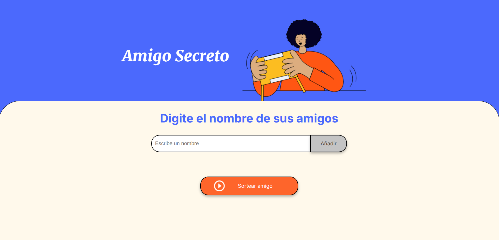

# Proyecto Amigo Secreto

Este es un proyecto simple de "Amigo Secreto" creado con **HTML**, **CSS** y **JavaScript** puro. El objetivo es permitir a los usuarios agregar nombres de amigos y sortear un amigo secreto de manera aleatoria, todo sin necesidad de backend.

## Características

- **Agregar amigos**: Los usuarios pueden introducir los nombres de sus amigos a través de un campo de texto.
- **Lista de amigos**: Los amigos agregados se muestran en una lista.
- **Sortear amigo secreto**: Los usuarios pueden hacer un sorteo aleatorio para asignar un amigo secreto a cada persona.
- **Interfaz interactiva**: El diseño es simple y accesible, con un botón para sortear y ver los resultados.

## Cómo usar el proyecto

1. **Clonar el repositorio**:
   ```bash
   git clone https://github.com/alfonso-ramos/amigo-secreto_alura
   ```

2. **Abrir el proyecto**:
   - Abre el archivo `index.html` en tu navegador.

3. **Añadir amigos**:
   - Ingresa los nombres de tus amigos en el campo de texto y presiona el botón "Añadir" para agregarlos a la lista.

4. **Sortear el amigo secreto**:
   - Haz clic en el botón "Sortear amigo" para ver quién le tocó a cada persona.

## Tecnologías utilizadas

- **HTML**: Para la estructura de la página.
- **CSS**: Para el diseño visual de la interfaz.
- **JavaScript**: Para la lógica del juego y la interacción con el usuario.

## Capturas de pantalla



## Contribuciones

Si deseas contribuir a este proyecto, sigue estos pasos:

1. Haz un fork de este repositorio.
2. Crea una nueva rama (`git checkout -b feature/nueva-funcionalidad`).
3. Realiza los cambios que desees.
4. Haz un commit de tus cambios (`git commit -am 'Agrega nueva funcionalidad'`).
5. Haz push a la rama (`git push origin feature/nueva-funcionalidad`).
6. Abre un pull request en GitHub.

